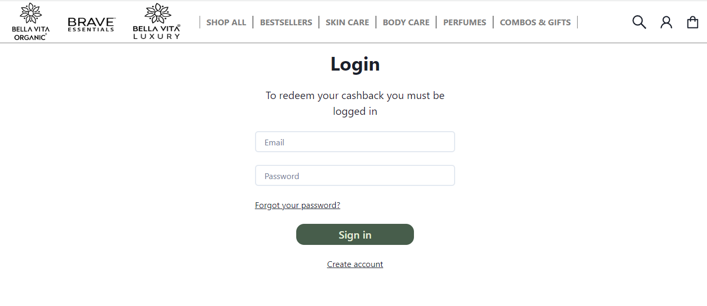

## BELLA VITA ORGANIC 

## Badges

This is E-commerce platforms selling a wide range of body beauty products for men's and women's like face cream, perfume etc. Here you can expect to find products you'll love, superior service, and fast global shipping!

## Technologies we used

- HTML
- CSS
- JAVASCRIPT
- Browser LocalStorage
- React
- Chakra UI

## Features

- There is login and logout functionality.
- Elegant navbar for easy navigation between pages and categories.
- Customers can view the Products list of a particular category.
- All page, showing various sizes and variants.

## Screenshots
A glimpse of our website

- On this page users can signup/sign-in based on whether the user is already registered or not.

Step :- 1

Step :- 2

- The landing page where users cans see various categories and subcategories along with offers and discounts.

Step :- 1

- Shopping bag page has all the items that are added to the cart/bag by the user.

- There is footer page where the user see terms and condition and connected to our social sites

## Demo

 [Demo link here](https://633999915adf255c20f32f18--super-cool-site-by-dhullsuman.netlify.app/) 

## Author

- [Suman Dhull](https://github.com/dhullsuman)